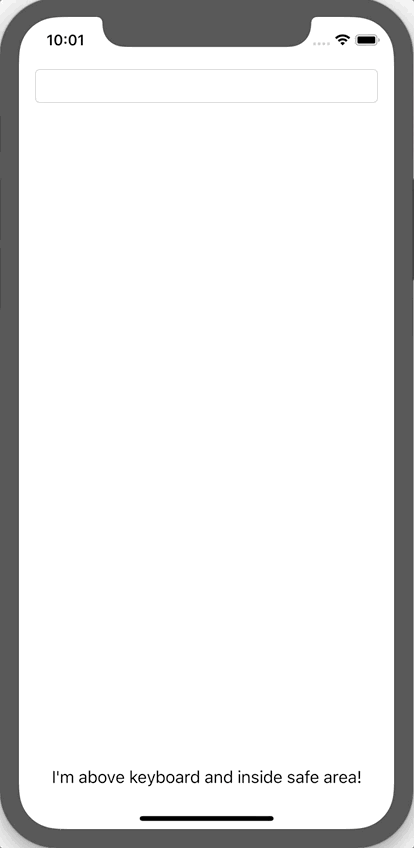

# ALSKeyboardLayoutGuide

[](https://travis-ci.org/lilingfeng/ALSKeyboardLayoutGuide)
[](https://cocoapods.org/pods/ALSKeyboardLayoutGuide)
[](https://cocoapods.org/pods/ALSKeyboardLayoutGuide)
[](https://cocoapods.org/pods/ALSKeyboardLayoutGuide)

## Example

To run the example project, clone the repo, and run `pod install` from the Example directory first.



Example Codes:
```swift
let label = UILabel()
label.textColor = .black
label.text = "I'm above keyboard and inside safe area!"
view.addSubview(label)
label.translatesAutoresizingMaskIntoConstraints = false
label.centerXAnchor.constraint(equalTo: view.centerXAnchor).isActive = true
label.bottomAnchor.constraint(lessThanOrEqualTo: view.keyboardLayoutGuide.topAnchor, constant: -8.0).isActive = true
if #available(iOS 11.0, *) {
    label.bottomAnchor.constraint(lessThanOrEqualTo: view.safeAreaLayoutGuide.bottomAnchor, constant: -8.0).isActive = true
} else {
    label.bottomAnchor.constraint(lessThanOrEqualTo: view.bottomAnchor, constant: -8.0).isActive = true
}
let constraint = label.bottomAnchor.constraint(equalTo: view.bottomAnchor, constant: 0.0)
constraint.priority = UILayoutPriority(1)
constraint.isActive = true
```

## Installation

### CocoaPods
ALSKeyboardLayoutGuide is available through [CocoaPods](https://cocoapods.org). To install
it, simply add the following line to your Podfile:

```ruby
pod 'ALSKeyboardLayoutGuide'
```

### Manually
Drag `ALSKeyboard.swift` and `UIView+KeyboardLayoutGuide.swift` files in `ALSKeyboardLayoutGuide/Classes` directory into your project.

## Usage
Use `view.keyboardLayoutGuide` property to layout with the subviews. 

**Note: the view's size should be same as the window or the screen. In other words, it's mostly the view of a view controller.**

## Author

Adelais0

## License

ALSKeyboardLayoutGuide is available under the MIT license. See the LICENSE file for more info.
